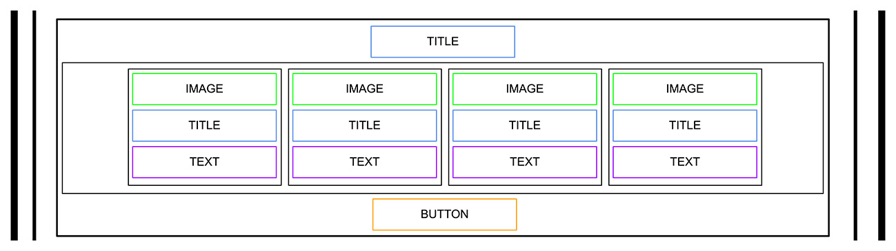

# Project: HTML, advanced

  The goal of this project is to implement from scratch a webpage from a designer file.

<h2>Resources</h2>

<strong>Read or watch</strong>:

<ul>
<li><a href="https://learn.shayhowe.com/html-css/" title="Learn to Code HTML &amp; CSS" target="_blank">Learn to Code HTML &amp; CSS</a> (<em>until &ldquo;Creating Lists&rdquo; included</em>)</li>
<li><a href="https://developer.mozilla.org/en-US/docs/Learn/HTML/Introduction_to_HTML" title="Introduction to HTML" target="_blank">Introduction to HTML</a> </li>
<li><a href="https://developer.mozilla.org/en-US/" title="MDN" target="_blank">MDN</a> </li>
</ul>

<h2>Learning Objectives</h2>

At the end of this project, you are expected to be able to <a href="/rltoken/tk1bYe9n6YmcEsF-gwOgMA" title="explain to anyone" target="_blank">explain to anyone</a>, <strong>without the help of Google</strong>:

<h3>General</h3>

<ul>
<li>What is HTML</li>
<li>How to create an HTML page from a wireframe</li>
<li>What is a markup language</li>
<li>What is the DOM</li>
<li>What is an element / tag</li>
<li>What is an attribute</li>
<li>What the purpose of each HTML tag</li>
</ul>

<h2>Requirements</h2>

<h3>General</h3>

<ul>
<li>All your files should end with a new line</li>
<li>A <code>README.md</code> file, at the root of the folder of the project is mandatory</li>
<li>You are <strong>not allowed</strong> to install, import or use external libraries. This website must be build with only HTML/CSS/JavaScript. No NodeJS, React, VueJS, Bootstrap, etc.</li>
<li>Your code should be W3C compliant and validate with <a href="/rltoken/czWaAX6ZYwSLoR3bh2Qiqg" title="W3C-Validator" target="_blank">W3C-Validator</a></li>
</ul>

  

## School Template Page

## School Template Page

<h2 class="gap">Tasks</h2>

   

      

  

    <h3 class="panel-title">
      0. README and objectives!
    </h3>

  

  

    

<!-- Progress vs Score -->

<!-- Task Body -->
   
In this and coming projects, you will implement from scratch a webpage from a designer file.

For this first project, you will focus on the HTML structure only - <strong>no CSS, no style - just pure HTML semantic.</strong>

This designer file will be available on <a href="/rltoken/ChJbK90Un6oS2A6ozdyTQA" title="Figma" target="_blank">Figma</a> - feel free to create an account to access the final result here:

<ul>
<li><a href="https://www.figma.com/file/XrEAsu1vQj5fhVaNG38d2W/Homepage?type=design&node-id=0-1&mode=design&t=NWnWj2Piejnx4jGk-0" title="Page in Figma" target="_blank">Page in Figma</a></li>
</ul>

And &ldquo;Duplicate to your Drafts&rdquo; to have access to all design details.

Important notes with Figma:

<ul>
<li>if your computer doesn&rsquo;t have missing fonts, you can find them here: <a href="https://www.fontsquirrel.com/fonts/source-sans-pro" title="source-sans-pro" target="_blank">source-sans-pro</a> and <a href="https://www.fontsquirrel.com/fonts/Spin-Cycle-OT" title="Spin-Cycle-OT" target="_blank">Spin-Cycle-OT</a></li>
<li>some values are in float - feel free to round them</li>
</ul>

For this task, please write an amazing <code>README.md</code>

  

    <h3 class="panel-title">
      1. Header
    </h3>

  

  

    

  <!-- Progress vs Score -->

<!-- Task Body -->

Let&rsquo;s start by the top: <strong>the header</strong>

Here the wireframe of it:

<ul>
<li>Create the HTML skeleton (<code>html</code>, <code>head</code>, <code>body</code>, etc.) </li>
<li>In the body, add an <code>header</code> tag</li>
<li>Inside this <code>header</code>:

<ul>
<li>Add a link element with an image inside</li>
<li>Add a block of 3 link elements </li>
</ul></li>
</ul>

  

    <h3 class="panel-title">
      2. Banner
    </h3>

  

  

    

<!-- Progress vs Score -->

 <!-- Task Body -->
   
Now, the banner under the <code>header</code>:

Under the <code>header</code>, add a <code>main</code> element with inside a <code>section</code> element.

In this <code>section</code> element, add:

<ul>
<li>A block with inside:

<ul>
<li>An heading tag (don&rsquo;t forget to use the correct heading value)</li>
<li>A text element</li>
<li>A button tag</li>
</ul></li>
<li>Another block with inside:

<ul>
<li>Another heading tag (same, be careful about which one you are using)</li>
<li>A block containing 4 blocks - each block with inside:

<ul>
<li>An image</li>
<li>An heading tag</li>
<li>A text</li>
</ul></li>
</ul></li>
</ul>

  

    <h3 class="panel-title">
      3. Quote
    </h3>
  

  

    

   <!-- Progress vs Score -->

   <!-- Task Body -->
   
Under the banner, we will add the quote block:

The quote section is inside the <code>main</code>:

<ul>
<li>Create a new <code>section</code> for the quote</li>
<li>Inside, add a block containing:

<ul>
<li>An image</li>
<li>Another block with inside:

<ul>
<li>A quote tag</li>
<li>An author quote</li>
<li>A text</li>
</ul></li>
</ul></li>
</ul>

  

    <h3 class="panel-title">
      4. Videos
    </h3>
  

  

    

<!-- Progress vs Score -->

<!-- Task Body -->

Let&rsquo;s now add the videos list:

New <code>section</code> with inside:

<ul>
<li>An heading tag</li>
<li>A block containing the 4 video block - each of them are composed with:

<ul>
<li>An image</li>
<li>An heading</li>
<li>A text</li>
<li>A block for the author:

<ul>
<li>A image</li>
<li>An heading</li>
</ul></li>
<li>A block for the rating:

<ul>
<li>A block of images (one star = one image)</li>
<li>A text</li>
</ul></li>
</ul></li>
</ul>

    <h3 class="panel-title">
      5. Membership
    </h3>

  

  

    

   <!-- Progress vs Score -->

  <!-- Task Body -->
  
Membership section is similar as the videos list:

After the videos list section, add a new <code>section</code> containing:

<ul>
<li>An heading</li>
<li>A block with inside 4 block item - each block defined with:

<ul>
<li>An image</li>
<li>An heading</li>
<li>A text</li>
</ul></li>
<li>A button</li>
</ul>

  

    <h3 class="panel-title">
      6. FAQ
    </h3>

  

  

    

   <!-- Progress vs Score -->

   <!-- Task Body -->
   
The FAQ section is ending the page before the footer:

Add a <code>section</code> for the FAQ with inside:

<ul>
<li>A block that contains 2 &ldquo;row block&rdquo;</li>
<li>Each &ldquo;row block&rdquo; contains 2 &ldquo;item block&rdquo;</li>
<li>Each &ldquo;item block&rdquo; is composed of:

<ul>
<li>An heading</li>
<li>A text</li>
</ul></li>
</ul>

  

    <h3 class="panel-title">
      7. Footer
    </h3>

  

  

    

   <!-- Progress vs Score -->

   <!-- Task Body -->
   
And&hellip; the footer!

After the last <code>section</code>, outside of the <code>main</code>, add a <code>footer</code>:

<ul>
<li>A global block (used later for centering the footer content), inside this block:

<ul>
<li>A &ldquo;row block&rdquo; with:

<ul>
<li>An image</li>
<li>A block with inside:

<ul>
<li>Images with link</li>
</ul></li>
</ul></li>
<li>A text</li>
</ul></li>
</ul>

And&hellip; that&rsquo;s it for the moment - the result should not be shiny, don&rsquo;t worry, CSS is coming&hellip;

  

